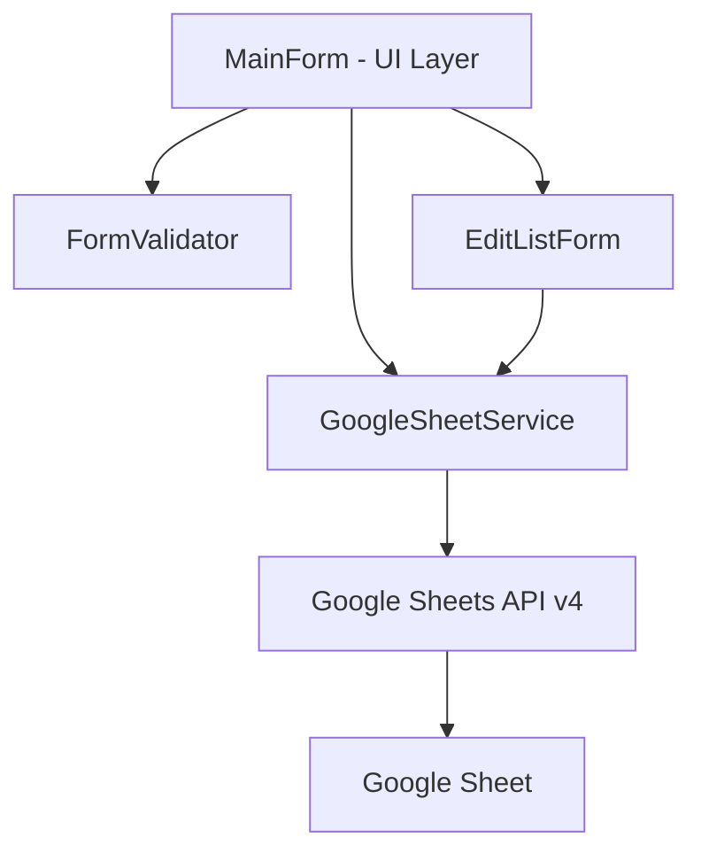

# Design Document: Simple Windows Data Entry App

## Overview

A standalone C#/WinForms desktop application that provides a data entry form for capturing customer payment information and persisting it to a Google Sheet. The app supports creating new entries and editing existing ones. Communication with Google Sheets is done via the Google Sheets API (v4) using a service account for authentication.

This is a separate project from the existing web application in the workspace. It will live in its own solution folder (e.g., `DataEntryApp/`).

## Architecture

The application follows a simple layered architecture appropriate for a small WinForms app:



### Layers

1. **UI Layer** (`MainForm`, `EditListForm`): WinForms forms handling user interaction.
2. **Validation Layer** (`FormValidator`): Pure logic for validating form input.
3. **Data Access Layer** (`GoogleSheetService`): Handles all read/write operations against the Google Sheets API.

### Key Design Decisions

- **Google Sheets API v4 with Service Account**: Uses a service account JSON key file for authentication. No OAuth user consent flow needed since this is a backend-style integration.
- **Separate Edit Form**: The edit/list view is a separate modal dialog (`EditListForm`) with a `DataGridView` for browsing and searching entries. Selecting a row populates the main form.
- **No local database**: All data lives in the Google Sheet. The app is a thin client.

## Components and Interfaces

### MainForm

The primary application window containing the data entry form.

- **Fields**: `txtName` (TextBox), `txtMobileNo` (TextBox), `txtStaffName` (TextBox), `txtAmount` (TextBox), `cmbPaymentMethod` (ComboBox), `btnSave` (Button), `btnEdit` (Button)
- **Behavior**:
  - On `btnSave` click: validate via `FormValidator`, then call `GoogleSheetService.AppendRowAsync()` or `GoogleSheetService.UpdateRowAsync()` depending on mode (new vs. edit).
  - On `btnEdit` click: open `EditListForm`. On selection, populate fields and switch to edit mode.
  - Tracks current mode: `isEditMode` (bool) and `editRowIndex` (int) to know which row to update.

### EditListForm

A modal dialog for browsing and selecting previously saved entries.

- **Controls**: `DataGridView` for displaying rows, `TextBox` for search/filter, `btnSelect` (Button), `btnCancel` (Button).
- **Behavior**:
  - On load: calls `GoogleSheetService.GetAllRowsAsync()` to fetch data.
  - Search filters the `DataGridView` rows by name or mobile number.
  - On select: returns the chosen row data and its row index back to `MainForm`.

### FormValidator

A static class with pure validation logic.

```csharp
public static class FormValidator
{
    public static ValidationResult Validate(EntryData entry);
}
```

- Returns a `ValidationResult` containing `bool IsValid` and `List<string> Errors`.
- Rules: Name not empty, MobileNo not empty, StaffName not empty, Amount > 0, PaymentMethod must be one of the allowed values.

### GoogleSheetService

Handles all Google Sheets API interactions.

```csharp
public class GoogleSheetService
{
    public GoogleSheetService(string credentialPath, string spreadsheetId, string sheetName);
    public Task AppendRowAsync(EntryData entry);
    public Task UpdateRowAsync(int rowIndex, EntryData entry);
    public Task<List<EntryData>> GetAllRowsAsync();
}
```

- Uses `Google.Apis.Sheets.v4` NuGet package.
- Authenticates via `GoogleCredential.FromFile()` with the service account JSON key.
- Sheet columns: Name | Mobile No | Staff Name | Amount | Payment Method.

## Data Models

### EntryData

```csharp
public class EntryData
{
    public string Name { get; set; }
    public string MobileNo { get; set; }
    public string StaffName { get; set; }
    public decimal Amount { get; set; }
    public string PaymentMethod { get; set; }
}
```

### ValidationResult

```csharp
public class ValidationResult
{
    public bool IsValid { get; set; }
    public List<string> Errors { get; set; } = new();
}
```

### Allowed Payment Methods

```csharp
public static readonly string[] AllowedPaymentMethods = { "Gpay", "Debit Card", "Credit Card" };
```


## Correctness Properties

*A property is a characteristic or behavior that should hold true across all valid executions of a system — essentially, a formal statement about what the system should do. Properties serve as the bridge between human-readable specifications and machine-verifiable correctness guarantees.*

### Property 1: Invalid entries are rejected by validation

*For any* `EntryData` where at least one field is invalid (Name is empty/whitespace, MobileNo is empty/whitespace, StaffName is empty/whitespace, Amount <= 0, or PaymentMethod is not in the allowed list), `FormValidator.Validate()` should return `IsValid = false` with a non-empty `Errors` list.

**Validates: Requirements 2.1, 2.2, 2.3, 2.4, 2.5**

### Property 2: Valid entries pass validation

*For any* `EntryData` where Name is non-empty/non-whitespace, MobileNo is non-empty/non-whitespace, StaffName is non-empty/non-whitespace, Amount > 0, and PaymentMethod is one of {"Gpay", "Debit Card", "Credit Card"}, `FormValidator.Validate()` should return `IsValid = true` with an empty `Errors` list.

**Validates: Requirements 2.1, 2.2, 2.3, 2.4, 2.5**

### Property 3: Append round-trip

*For any* valid `EntryData`, appending it via `GoogleSheetService.AppendRowAsync()` and then retrieving all rows via `GetAllRowsAsync()` should return a list containing an entry with matching Name, MobileNo, StaffName, Amount, and PaymentMethod values.

**Validates: Requirements 3.1**

### Property 4: Update round-trip

*For any* existing row and any valid modified `EntryData`, calling `GoogleSheetService.UpdateRowAsync()` with the row index and new data, then retrieving that row via `GetAllRowsAsync()`, should return the updated values.

**Validates: Requirements 4.4**

### Property 5: Form cleared after successful save

*For any* successful save or update operation, all form input fields (Name, MobileNo, StaffName, Amount, PaymentMethod) should be reset to their default empty/unselected state.

**Validates: Requirements 3.3, 4.5**

### Property 6: Search filter returns matching entries

*For any* list of `EntryData` rows and any search string, the filtered results should only contain entries where the Name or MobileNo contains the search string (case-insensitive).

**Validates: Requirements 4.2**

### Property 7: Form population matches selected entry

*For any* `EntryData` selected from the edit list, the form fields should be populated such that each field value exactly matches the corresponding property of the selected entry.

**Validates: Requirements 4.3**

## Error Handling

| Scenario | Handling |
|---|---|
| Validation failure on Save | Show `MessageBox` with all validation errors. Do not call Google Sheets API. |
| Google Sheets API unreachable (append) | Catch exception, show `MessageBox` with error details. Form data is preserved so user can retry. |
| Google Sheets API unreachable (update) | Same as above — catch, show error, preserve form data. |
| Google Sheets API unreachable (fetch for edit) | Catch exception, show `MessageBox`, close the edit dialog. |
| Service account credentials missing/invalid | Show `MessageBox` on app startup or first API call. Log details. |
| Invalid Amount input (non-numeric) | Use `decimal.TryParse` — if it fails, treat as validation error (Amount invalid). |

## Testing Strategy

### Unit Tests

Unit tests cover specific examples, edge cases, and UI behavior:

- Verify all form controls exist on `MainForm` (Requirements 1.1–1.6).
- Verify `ComboBox` contains exactly the three payment methods (Requirement 1.5).
- Verify success message is shown after save (Requirement 3.2).
- Verify error message is shown when API throws (Requirements 3.4, 4.6).
- Verify Edit button opens the edit list form (Requirement 4.1).
- Verify form fields are cleared after successful save/update (edge case confirmation).

### Property-Based Tests

Property-based tests use **FsCheck** (NuGet: `FsCheck` + `FsCheck.Xunit`) with xUnit as the test runner. Each property test runs a minimum of 100 iterations.

Each test is tagged with a comment referencing the design property:

```csharp
// Feature: simple-windows-app, Property 1: Invalid entries are rejected by validation
[Property(MaxTest = 100)]
public Property InvalidEntriesAreRejected() { ... }

// Feature: simple-windows-app, Property 2: Valid entries pass validation
[Property(MaxTest = 100)]
public Property ValidEntriesPassValidation() { ... }
```

Property tests to implement:

| Property | What it tests | Library |
|---|---|---|
| Property 1 | `FormValidator` rejects any entry with at least one invalid field | FsCheck |
| Property 2 | `FormValidator` accepts any entry with all valid fields | FsCheck |
| Property 3 | Append then retrieve returns matching data (integration, uses mock/stub) | FsCheck |
| Property 4 | Update then retrieve returns updated data (integration, uses mock/stub) | FsCheck |
| Property 5 | Form fields cleared after any successful operation | FsCheck |
| Property 6 | Search filter only returns entries matching the query | FsCheck |
| Property 7 | Form population matches selected entry exactly | FsCheck |

Properties 1, 2, and 6 are pure logic tests (no external dependencies). Properties 3 and 4 should use a mock/in-memory implementation of `GoogleSheetService` to avoid hitting the real API. Properties 5 and 7 test form behavior and can use the WinForms controls directly in test.
